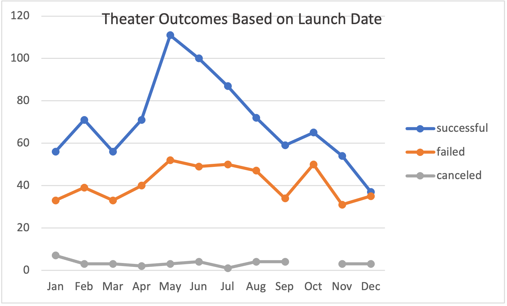
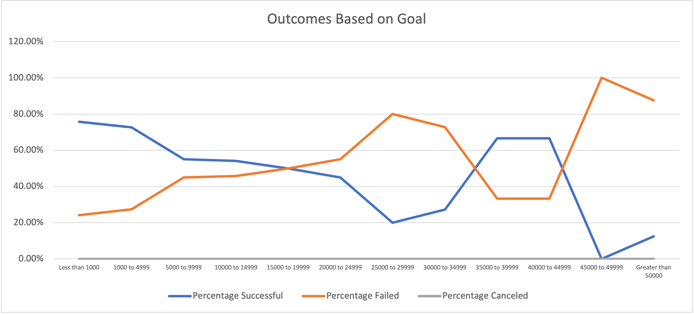

# Kickstarting with Excel

## Overview of Project
    
### Purpose
The following analysis dissects data from Kickstarter in order to gain information on what factors will lead to successful outcomes in the funding of campaigns. Two analyses are completed: The first analysis focuses on outcomes based on the month of a year a campaign is launched, while the second takes a look at the success levels of different campaign goals. Both of the analyses have a central focus of theater/play Kickstarter campaigns. 

The purpose of this analysis is to decide which factors will lead to fundraising success to share with a playwright, Louise, more information for future launches. Louise's play almost reached its goal amount. Thus, we are helping her gain information on how other plays, with a similar status to her own, compare based on their goals and launch dates. By analyzing this Kickstarter data and creating visualizations we are able to uncover trends to share with Louise so that she may find more success in future projects.

## Analysis and Challenges

### Analysis of Outcomes Based on Launch Date
The first procedure conducted is an analysis that observes the outcomes of different Kickstarter launch dates. To begin the process, the year of various launch dates needed to be found. This was done using the YEAR () function in excel. As we already had a column for campaign launch dates all that needed to be done was to insert the cell number of the desired year (Ex: =YEAR(A2)). After this was completed, a pivot table was made by filtering parent categories and years. I then put outcomes in the columns and values field. Finally, I marked the rows as the date created conversion. The final step is to filter by the parent category of "theater" as this is the information most pertinent to our analysis. 

After completing the pivot table, a pivot chart was made. When the chart is automatically created, it puts it in a stacked column format. The chart was changed to be a line graph by using the design tab in Excel and changing the format to a line graph with markers. The completed pivot chart looks like the following:  This graph displays information how theater Kickstarters succeeded, failed, or were canceled depending on various months of the year.

### Analysis of Outcomes Based on Goals
The second analysis looks at outcomes related to the goals people set for their Kickstarter campaigns. To complete this task, first information on the number of successful, failed, and canceled campaigns were gathered using the COUNTIFS () function.  In order to use this function, we filtered goals within a certain dollar range, by outcome, and by subcategory. The number of campaigns that fit these requirements were then counted and output from the function. For example, to find the number of plays that were less than $1000 and successful we used the function =COUNTIFS('Kickstarter!'!D:D,"<1000",'Kickstarter!'!F:F, "successful",'Kickstarter!'!R:R,"plays"). This first sorts all items less than $1000 in the goal column, then sorts items that were successful, and filters items contained the subcategory of "plays". The function then outputs that there are 141 items that fit these requirements. This process was then repeated for all goal ranges and for all 3 outcomes possible. After this was completed, the total number of projects were found within each goal range by adding up the counts for successful, failed, and canceled using the SUM () function. Once this information had been found for all goal ranges, the percentage of each outcomes goal range was found. To do this the number of the outcomes was divided by the total projects. For example, to find the percentage of projects that failed in the 5000 to 9999 range you input "=C4/E4" to divide number failed by number successful. Finally, the values must be changed from general to percentages. 

When the needed information is found, we can make a line graph to display the information. To do this the goal column, percentages successful, failed, and canceled were selected and then a line graph was inserted to create the following image: . The chart was titled "Outcomes Based on Goals" with the goal ranges on the x-axis, percent values on the y-axis, and the three various outcomes charted in the graph.

### Challenges and Difficulties Encountered
There were a few challenges that I overcame throughout the process of the two analyses. I initially struggled while creating my pivot table for the Outcomes Based on Launch Date analysis. The part I struggled with was when creating my pivot table. I struggled finding which field to add into the axis category so that the months of the year would be displayed in the rows. When I put the "Date Created Conversion" into this field, years were shown for row labels, but I wanted just the months. I noticed then that when I added the Date Created Conversion it automatically created two other categories for this field being Years and Quarters. I did not want these items, so I deleted them and then I was left with just the months of the year in the row labels and my issue was solved. 

I had a few more difficulties throughout the second analysis of Outcomes Based on Goals. The biggest challenge I encountered was with the COUNTIFS () function. I kept receiving an error in my cells that stated "#VALUE!". I found that I was making an error when referencing the sheet name that I was obtaining my data from. For example, if a sheet is named "Original" to reference a column from that sheet in the COUNTIFS () function you refer to it as =COUNTIFS(Original!D:D...). In this function the sheet name is listed, followed by an exclamation point, then the column is listed. However, my sheet was named "Kickstarter!" since I had an exclamation point in my sheet name this meant I needed two exclamation points in the formula to tell the function to then look at the column listed. Also, since there was a special character in my sheet name, it needed to be referenced using single quotation marks. Once I typed in the function as =COUNTIFS('Kickstarter!'!D:D...) my error then was fixed and this challenge was resolved. The other challenge I found in this analysis was in listing each of the percentages using the percentage format. I was able to solve to find the percent, but then when I made a line graph the amounts were just listed as decimals. To fix this issue I went to the home tab of excel and changed the number format from general to percentage. From this point my values were automatically listed using a percentage sign.

## Results

### What are two conclusions you can draw about the Outcomes based on Launch Date?
Looking at the data from the Outcomes Based on Launch Date chart it can be seen that May is the best month to launch a theater Kickstarter campaign as it has the highest number of successes. Another conclusion that can be drawn is that you may not want to launch your theater campaign in December. In December, there are the lowest number of successes as well as the successes and failures come in at a nearly an equal amount. In May there were 111 successes whereas in December the successes are at 35.

### What can you conclude about the Outcomes based on Goals?
In analyzing the Outcomes Based on Goals data it can be seen that plays were not cancelled but only either succeeded or failed. Since there is no cancelled data, this leaves the successes and failures lines to mirror one another (each is the other's opposite). Overall, in observing the successes and failures based on goals it can be seen that as the goal amounts increased there were less successes and more failures except for an instance in the 35000 to 40000 range where the values swapped.

### What are some limitations of this dataset?
One limitation from this dataset is that we are only observing fundraising that occurred through the Kickstarter website. There are many avenues in order to source funding for projects and we are only seeing how people fared using this one avenue. Perhaps the goals set, and month of launch may vary if Kickstarter was not the primary source of funding. Another limitation from this data set is that there may have been outside factors unseen that contributed towards the outcome of a campaign. For example, a campaign that had a high amount of advertisement or recognition may affect the number of backers and therefore success. Another limitation may be the sample size. In observing our dataset, it can be seen that the majority of data comes from the US and GB. If Louise is launching her play in the US, perhaps data centered around plays closer to her location would better help to inform her decisions.

### What are some other possible tables and/or graphs that we could create?
Another possible graph we could make could compare the amount of time that a campaign was listed and how this related to the outcomes. To do this, we could create a table using the deadline and launch date information to find the number of days a campaign was listed. We could use this value for our x-axis and then have the outcomes as lines in the graph to observe trends based on the duration of launch. We could also create a bar chart that would compare the success rates of different countries’ theater/play campaigns. Another graph we could create could demonstrate the relationship between the number of backers and outcome. To do this we could create a histogram for successful theater/play campaigns. On the x-axis we could have the number of backers and the y-axis could display the frequency, from this we could observe the most frequent number of backers there were in successful campaigns.
